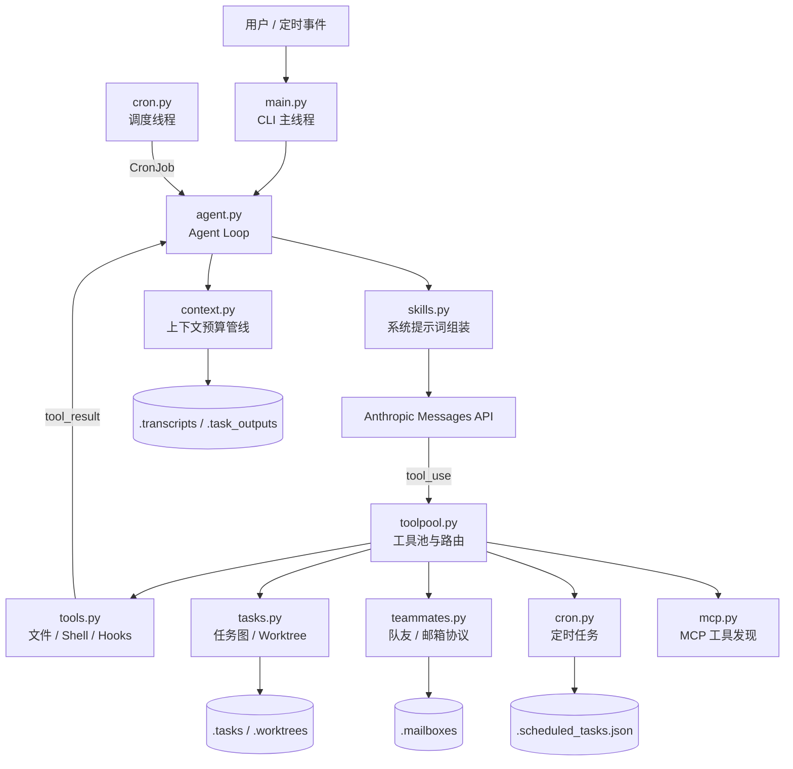

# Teach Agent

一个简单但全面的模块化 CLI 编码代理。该项目参考[learn-claude-code](https://github.com/shareAI-lab/learn-claude-code)，以 Anthropic Messages API 为推理内核，在一个主循环中组合了工具调用、上下文压缩、子代理与队友协作、任务图、Git worktree、定时任务、技能加载和 MCP 工具发现等能力。

## 快速开始

运行环境：Python 3.10+，以及可用的 Anthropic API 凭据。

```bash
pip install -r requirements.txt
export ANTHROPIC_API_KEY="your-api-key"
export MODEL_ID="your-model-id"
python main.py
```

也可以在项目根目录创建 `.env`，写入相同的 `ANTHROPIC_API_KEY` 与 `MODEL_ID`。可选配置项包括 `ANTHROPIC_BASE_URL`（兼容网关地址）和 `FALLBACK_MODEL_ID`（服务过载时使用的后备模型）。在交互界面输入 `q`、`exit` 或空行可退出。

## 总体架构



运行时的核心闭环是：主线程将用户输入写入 `history`，`agent_loop` 先治理上下文并重建系统提示词/工具池，再请求模型；模型返回文本则结束本轮，返回 `tool_use` 则经统一工具执行管线处理，并将结果作为 `tool_result` 继续送回模型。

## 执行流程

1. `main.py` 启动时扫描本地技能、加载持久化定时任务，并启动 cron 调度线程和定时任务执行线程。
2. 用户输入通过 `UserPromptSubmit` hook 后进入共享 `history`；`agent_lock` 保证用户回合和定时回合不会并发修改历史。
3. `agent.py` 在每次模型调用前执行 `prepare_context()`、刷新内存/MCP/队友状态，并由 `skills.py` 组装系统提示词。
4. `toolpool.py` 把内置工具和已连接 MCP 服务的工具合并为本轮可用工具集。
5. 工具调用由 `tools.execute_tool_call()` 统一经过 `PreToolUse` 权限检查、执行、`PostToolUse` hook；结果回填至会话。
6. 任务、队友、cron 等异步能力把事件注入同一主循环，保持对话上下文连续。

## 模块职责

| 模块 | 职责 |
| --- | --- |
| `main.py` | CLI 入口；初始化共享历史与 `WorkingState`，启动后台线程，串行处理用户回合。 |
| `config.py` | 环境变量校验、Anthropic 客户端、模型/重试/上下文阈值及工作目录等全局配置。 |
| `agent.py` | LLM 调用循环、429/529 重试与模型降级、超长响应恢复、后台 Shell 任务和当前回合状态记录。 |
| `toolpool.py` | 工具 schema 与 handler 注册表；将内置工具、任务、协作、cron 和 MCP 工具组装为统一工具池。 |
| `tools.py` | Shell、读写编辑、glob、todo 等基础工具；权限、日志、大输出、停止等 hooks。 |
| `context.py` | 工具结果落盘、历史裁剪、微压缩、LLM 摘要压缩与 transcript 保存。 |
| `skills.py` | 扫描 `skills/*/SKILL.md` 的 frontmatter，维护技能注册表并动态组装系统提示词。 |
| `tasks.py` | 文件持久化任务及依赖检查；创建、保留与安全删除 Git worktree。 |
| `teammates.py` | 基于 JSONL 邮箱的队友通信、计划审批/关停协议、自治认领任务与 worktree 上下文切换。 |
| `cron.py` | 五段式 cron 解析校验、内存队列、持久化任务与调度触发。 |
| `mcp.py` | MCP 客户端抽象与服务工具的延迟发现；当前提供 `docs`、`deploy` 两个模拟服务。 |
| `working_state.py` | 当前回合的目标、已改文件、验证记录和阻塞项的轻量内存状态。 |

## 工具与扩展机制

### 内置工具

`toolpool.py` 定义模型可见的 schema，并将名称映射到 Python handler。主要类别如下：

- 基础开发：`bash`、`read_file`、`write_file`、`edit_file`、`glob`、`todo_write`
- 代理能力：`task`（同步子代理）、`load_skill`、`compact`
- 任务与隔离：`create_task`、`list_tasks`、`claim_task`、`complete_task`、`create_worktree`、`remove_worktree`、`keep_worktree`
- 协作：`spawn_teammate`、`send_message`、`check_inbox`、`request_plan`、`review_plan`、`request_shutdown`
- 调度与集成：`schedule_cron`、`list_crons`、`cancel_cron`、`connect_mcp`

`compact` 由 `agent.py` 特殊处理；标记 `run_in_background: true` 的 `bash` 会立即返回任务占位符，完成结果稍后作为 `task_notification` 注入后续回合。

### 权限与 Hook

所有经主代理或队友执行的工具调用都会经过 hook 管线：

- `PreToolUse`：拒绝高危 Shell 片段；对破坏性命令、工作目录外写入和部署类 MCP 工具进行交互确认。
- `PostToolUse`：检测特别大的输出。
- `UserPromptSubmit` / `Stop`：记录输入与回合结束的运行信息。

Hook 注册点在 `tools.py`，新增策略无需修改各个工具实现。

### Skills 与 MCP

- Skills：在 `skills/<skill-name>/SKILL.md` 中定义；启动时由 `scan_skills()` 扫描。模型可先查看技能目录，再通过 `load_skill` 按需读取完整内容。
- MCP：调用 `connect_mcp` 后，服务端工具将以 `mcp__<server>__<tool>` 的名称合并进工具池。当前实现为教学用的本地 mock，而非外部 MCP 协议传输。

## 状态与持久化

| 路径 | 内容 | 生命周期 |
| --- | --- | --- |
| `.tasks/task_*.json` | 任务、依赖、所有者、状态与绑定 worktree | 持久化 |
| `.worktrees/` | Git worktree 及 `events.jsonl` 操作事件 | 持久化 |
| `.mailboxes/<agent>.jsonl` | 队友的追加式消息邮箱 | 消费后删除对应邮箱文件 |
| `.scheduled_tasks.json` | durable cron 任务快照 | 持久化 |
| `.transcripts/` | 上下文压缩前的会话快照 | 持久化 |
| `.task_outputs/tool-results/` | 超大工具输出的完整内容 | 持久化 |
| `.memory/MEMORY.md` | 可注入系统提示词的长期记忆 | 可选持久化输入 |

## 上下文与可靠性设计

`context.py` 采用分层治理：先把超过阈值的工具输出转存到磁盘并保留预览，再裁剪历史消息、压缩旧轮工具结果；仍超过 `CONTEXT_LIMIT` 时才调用模型生成摘要。若服务端报上下文过长，`agent.py` 会执行一次 reactive compaction 后重试。

模型请求使用流式接口。网络限流（429）和过载（529）采用指数退避；连续过载达到阈值时，如配置了 `FALLBACK_MODEL_ID` 则切换后备模型。对于 `max_tokens` 截断，先提升输出额度，再注入 continuation prompt 继续执行。

## 多代理与任务协作

`task` 是前台同步子代理：仅拥有文件与 Shell 等核心工具，完成后将简短总结返回主代理。

`spawn_teammate` 创建后台自治队友。队友通过 `.mailboxes` 与 `lead` 通信，空闲时会扫描并原子认领无依赖阻塞的任务。若任务绑定 Git worktree，队友的文件和 Shell 工具会自动切换到该目录。计划提交后会等待 lead 的批准或拒绝；关停请求也通过带 `request_id` 的协议消息配对，避免串台。

## 开发提示

- `WORKDIR` 取进程启动目录，因此建议始终在项目根目录执行 `python main.py`。
- worktree 功能依赖当前目录处于 Git 仓库且存在 `HEAD`；删除默认会检查未提交修改与未推送提交。
- 定时表达式使用五段格式：`分 时 日 月 周`，支持 `*`、`*/n`、列表和范围；日与周字段同时指定时遵循 cron 常见的“任一匹配”语义。
- 本仓库目前未包含自动化测试套件。修改后可先运行 `python -m py_compile *.py` 进行基础语法检查。
